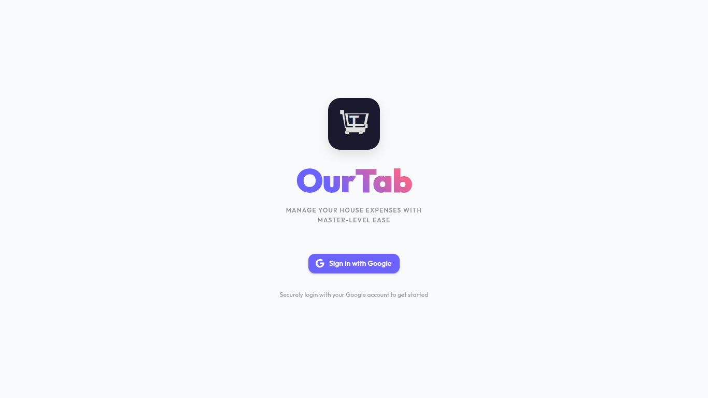
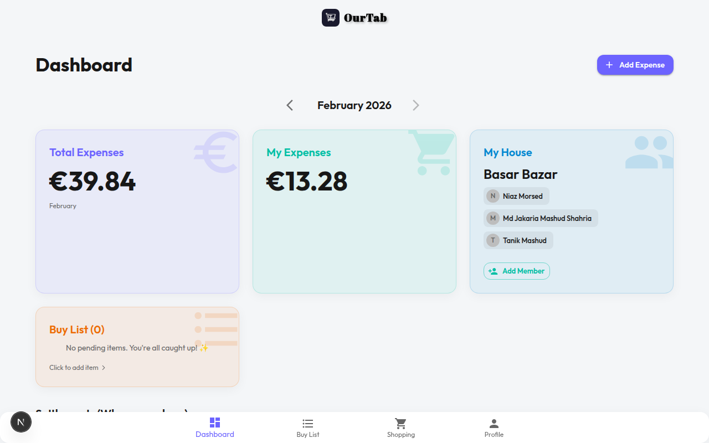
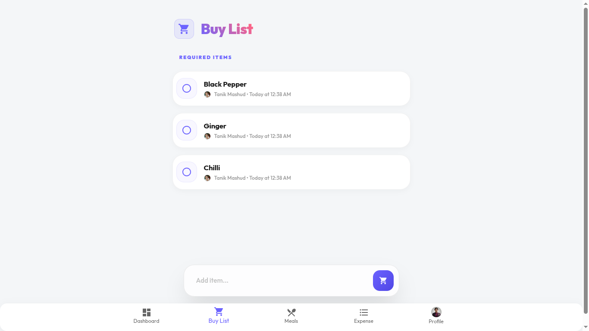
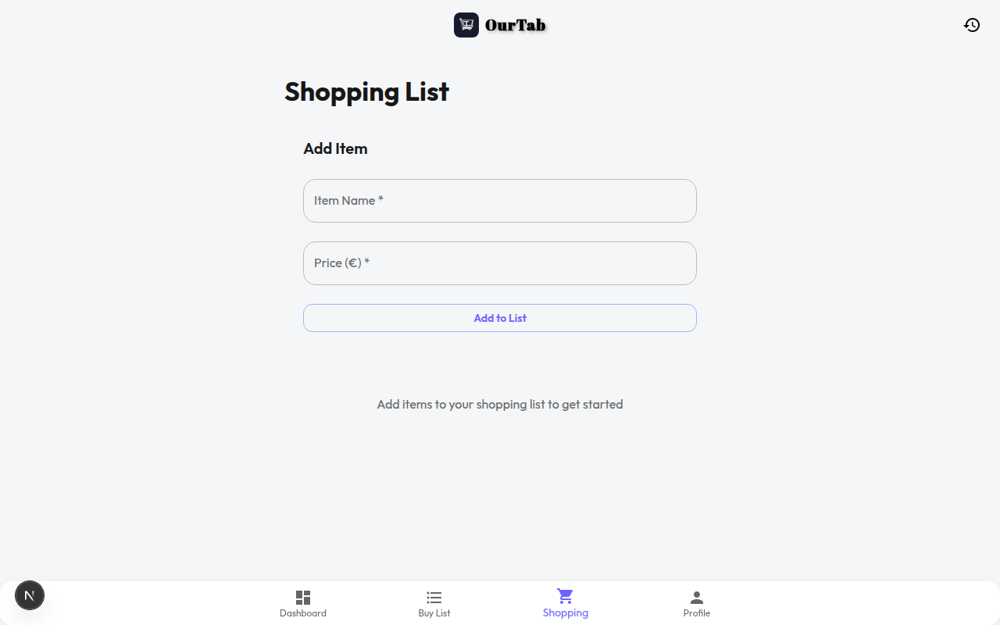
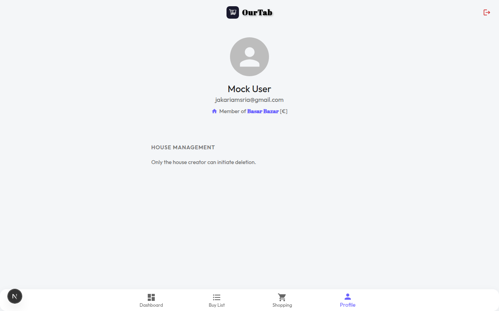

# 🛒 OurTab — Shared Expense & Grocery Tracker

> **OurTab** is a real-time collaborative household expense tracker. Built for housemates and families, it makes splitting grocery bills, tracking who owes what, and managing your shared buy list effortlessly simple.

---

## ✨ Features

### 🔐 Authentication & Security
- **Google Sign-In** via Firebase Authentication.
- **Protected Routes** — unauthenticated users are redirected to the login page.
- **Persistent Sessions** across page refreshes.
- **Permission-based Access** — only house members can view expenses, and only owners can edit them within a 48-hour window.

### 🏠 House Management
- **Named Households** — create or join a house via invite.
- **Role System** — **Managers** can update member settings (Rent, Role) and approve requests. **Members** have standard access.
- **Manager Promotion** — dynamic role switching; if a non-creator manager promotes someone else, they revert to member status.
- **Meal Management** — toggle "Meals On/Off" with a manager approval flow and automatic transition periods.
- **Fund Deposits** — members can deposit funds into the house account (e.g., for rent or utilities), requiring manager verification.
- **Collaborative Deletion** — house deletion requires approval from all members to prevent accidental data loss.

### 📊 Financial Dashboard
- **Real-time Overview** — total house expenses vs. your personal monthly spending.
- **Smart Settlements** — automated calculation of who owes whom, optimized to minimize transaction count.
- **Expense History** — browse recent expenses or navigate through previous months with ease.
- **Currency Support** — configurable house currency ($, ₹, £, etc.).
- **PDF Export** — generate professional expense reports with one click (via jsPDF).

### 🧾 Shopping & Expenses
- **Multi-Contributor Splitting** — split bills by absolute amounts or percentages.
- **Shortcut Actions** — "I Pay All" or "Split Equally" for rapid entry.
- **Interactive Buy List** — shared list with auto-capitalization and check-off history.
- **✨ Smart Auto-Mark** — when an expense is added (e.g., "Bread"), the matching item on the buy list is automatically ticked.
- **Cleanup Automation** — completed items auto-delete after 12 hours, with a 5-minute safety window for accidental unmarking.

---

## 🔔 Notifications System

OurTab keeps the whole house in sync with real-time, categorized alerts:

- **🛒 Shopping Alerts** — notified when housemates add items to the Buy List.
- **🧾 Expense Alerts** — stay updated whenever a new bill is added or an old one is edited.
- **💳 Payment & Funds** — alerts for payment requests, approval of fund deposits, or settled debts.
- **🏠 House Management** — notifications for new members joining, role changes (promoted to Manager), or house deletion requests.
- **🍽️ Meal Requests** — managers are notified when a member requests to turn off their meals for upcoming days.
- **🎂 Special Occasions** — automated birthday reminders for house members.
- **🔊 Live Feedback** — visual "pulse" indicators for unread alerts and custom notification sounds.

---

## 📸 Screenshots

### Login Page


### Dashboard


### Buy List


### Shopping / Add Expense


### Profile


---

## 🛠️ Tech Stack

| Category | Package | Notes |
|---|---|---|
| **Framework** | [Next.js 16](https://nextjs.org/) | App Router, API Routes, SSR |
| **Language** | TypeScript 5 | End-to-end type safety |
| **UI Library** | [Material UI v7](https://mui.com/) | Components, icons, theming |
| **Styling** | MUI Emotion + Vanilla CSS | Glassmorphism design system |
| **Auth + DB** | [Firebase v12](https://firebase.google.com/) | Auth (Google), Firestore |
| **Data Fetching** | [SWR v2](https://swr.vercel.app/) | React Hooks for data fetching with caching |
| **PDF Generation** | [jsPDF v4](https://github.com/parallax/jsPDF) + [jspdf-autotable](https://github.com/simonbengtsson/jsPDF-AutoTable) | Expense report PDF export |
| **PWA** | [@ducanh2912/next-pwa](https://github.com/DuCanh2912/next-pwa) | Installable as a mobile app |

---

## 🚀 Getting Started

### Prerequisites
- Node.js 18+
- A Firebase project with **Firestore** and **Firebase Auth (Google provider)** enabled

### 1. Clone the repo
```bash
git clone https://github.com/your-username/our-tab.git
cd our-tab
```

### 2. Install dependencies
```bash
npm install
```

### 3. Set up environment variables

Create a `.env.local` file in the root directory:
```env
NEXT_PUBLIC_FIREBASE_API_KEY=your_api_key
NEXT_PUBLIC_FIREBASE_AUTH_DOMAIN=your_project.firebaseapp.com
NEXT_PUBLIC_FIREBASE_PROJECT_ID=your_project_id
NEXT_PUBLIC_FIREBASE_STORAGE_BUCKET=your_project.appspot.com
NEXT_PUBLIC_FIREBASE_MESSAGING_SENDER_ID=your_sender_id
NEXT_PUBLIC_FIREBASE_APP_ID=your_app_id
IREBASE_ADMIN_CREDENTIALS=your_admin_credentials
```

### 4. Run the development server
```bash
npm run dev
```

Open [http://localhost:3000](http://localhost:3000) in your browser.

---

## 📁 Project Structure

```text
src/
├── app/
│   ├── api/                  # Next.js API routes (Firestore operations)
│   │   ├── auth/             # Firebase Authentication logic
│   │   ├── expenses/         # Create, read, update, delete expenses
│   │   ├── fund-deposits/    # Managing house fund deposits and approvals
│   │   ├── houses/           # House management, member add/delete, roles
│   │   ├── meals/            # Meals On/Off toggles and manager approval
│   │   ├── notifications/    # Notifications CRUD and read flags
│   │   ├── settlements/      # Settlement calculation logic
│   │   ├── shopping-todos/   # Buy List CRUD and auto-marking
│   │   └── users/            # User profile data
│   ├── buy-list/             # Buy List page
│   ├── dashboard/            # Core financial overview & settlements page
│   ├── meals/                # Meals management UI
│   ├── notifications/        # Alerts & notifications page
│   ├── profile/              # Account & household settings page
│   ├── shopping/             # Live shopping / expense entry page
│   ├── globals.css           # Global styles and design system
│   └── layout.tsx            # Main application layout wrapper
├── components/
│   ├── AuthContext.tsx       # Global Firebase auth & user provider
│   ├── AuthGuard.tsx         # HOC to protect authenticated routes
│   ├── BottomNav.tsx         # Mobile-first bottom navigation
│   ├── Navbar.tsx            # Sticky top bar with theme toggle
│   ├── NotificationBell.tsx  # Drawer-based notification UI
│   ├── ThemeRegistry.tsx     # MUI Emotion & SSR provider
│   └── ToastContext.tsx      # Global dynamic toast alerts
├── hooks/
│   ├── useHouseData.ts       # Central data fetcher (houses, expenses, todos)
│   ├── useNotifications.ts   # Notification polling & mutation
│   ├── useShoppingTodos.ts   # Specialized Buy List hook
│   └── useUserData.ts        # Fetches authenticated user's profile
├── lib/
│   ├── firebase.ts           # Firebase client-side initialization
│   ├── firebaseAdmin.ts      # Server-side Admin SDK initialization
│   └── notifications.ts      # Unified server-side notification trigger
├── types/
│   ├── fund-types.ts         # Deposit & refund interfaces
│   ├── meal-types.ts         # User meal state interfaces
│   ├── notification.ts       # Unified notification schema
│   └── settlement-types.ts   # Debt & credit interfaces
├── utils/
│   ├── currency.ts           # Currency formatting & symbol helpers
│   ├── date.ts               # Locale-aware time & frequency formatting
│   └── notificationSound.ts  # Feedback audio utility
└── theme.ts                  # Shared MUI Light/Dark theme definition
```

---

## 🔒 Security

See [Firestore Security Rules](https://firebase.google.com/docs/firestore/security/get-started) — the project uses rules that ensure:
- Only authenticated users can read/write data
- Only house members can access a house's expenses and todos
- Only the expense owner can edit/delete their own expense
- Only the house creator can initiate deletion

---

## 📱 PWA Support

OurTab is configured as a Progressive Web App. Users on mobile can tap **"Add to Home Screen"** to install it as a native-like app.

---

## 📄 License

MIT — feel free to use or fork for your own household!
